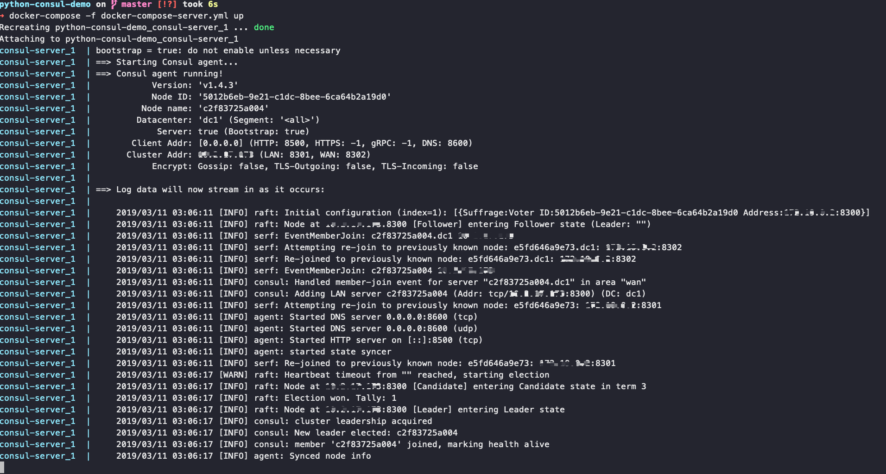
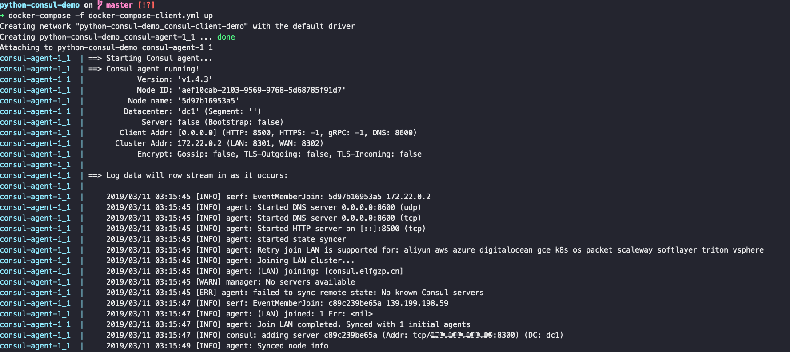
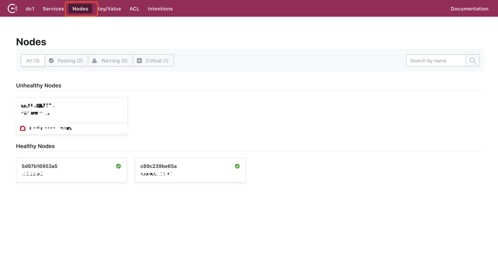

# Python Consul Demo

> 本项目为 Consul 的各种使用 Demo

README 前半部分主要为 Consul 的一些介绍，若已经了解 Consul，可以直接跳转到：

[使用 Consul 作为 Python 微服务的配置中心](#使用 Consul 作为 Python 微服务的配置中心)

## Consul 简单介绍

`Consul` 是 HashiCorp 公司推出的开源工具，用于实现分布式系统的服务发现与配置。Consul 是分布式的、高可用的、 可横向扩展的。它具备以下特性:

- 服务发现: Consul 提供了通过 DNS 或者 HTTP 接口的方式来注册服务和发现服务。一些外部的服务通过 Consul 很容易的找到它所依赖的服务。
- 健康检测: Consul 的 Client 提供了健康检查的机制，可以通过用来避免流量被转发到有故障的服务上。
- `Key/Value` 存储: 应用程序可以根据自己的需要使用 Consul 提供的 Key/Value 存储。 Consul 提供了简单易用的 HTTP 接口，结合其他工具可以实现动态配置、功能标记、领袖选举等等功能。
- 多数据中心: Consul 支持开箱即用的多数据中心. 这意味着用户不需要担心需要建立额外的抽象层让业务扩展到多个区域。


### Consul 架构图解

Consul 集群间使用了 `Gossip` 协议通信和 raft 一致性算法。上面这张图涉及到了很多术语：

- Gossip —— Gossip protocol 也叫 Epidemic Protocol （流行病协议），实际上它还有很多别名，比如：“流言算法”、“疫情传播算法”等。
  这个协议的作用就像其名字表示的意思一样，非常容易理解，它的方式其实在我们日常生活中也很常见，比如电脑病毒的传播，森林大火，细胞扩散等等。
- Client —— 一个 Client 是一个转发所有 RPC 到 server 的代理。这个 client 是相对无状态的。client 唯一执行的后台活动是加入 LAN gossip 池。这有一个最低的资源开销并且仅消耗少量的网络带宽。
- Server —— 一个 server 是一个有一组扩展功能的代理，这些功能包括参与 Raft 选举，维护集群状态，响应 RPC 查询，与其他数据中心交互 WAN gossip 和转发查询给 leader 或者远程数据中心。
- DataCenter —— 虽然数据中心的定义是显而易见的，但是有一些细微的细节必须考虑。例如，在 EC2 中，多个可用区域被认为组成一个数据中心。我们定义数据中心为一个私有的，低延迟和高带宽的一个网络环境。这不包括访问公共网络，但是对于我们而言，同一个 EC2 中的多个可用区域可以被认为是一个数据中心的一部分。
- Consensus —— 一致性，使用 Consensus 来表明就 leader 选举和事务的顺序达成一致。为了以容错方式达成一致，一般有超过半数一致则可以认为整体一致。Consul 使用 Raft 实现一致性，进行 leader 选举，在 consul 中的使用 bootstrap 时，可以进行自选，其他 server 加入进来后 bootstrap 就可以取消。
- LAN Gossip —— 它包含所有位于同一个局域网或者数据中心的所有节点。
- WAN Gossip —— 它只包含 Server。这些 server 主要分布在不同的数据中心并且通常通过因特网或者广域网通信。
- RPC——远程过程调用。这是一个允许 client 请求 server 的请求/响应机制。


#### Gossip 介绍

这里先简单介绍一下 `Gossip` 协议的执行过程：

Gossip 过程是由种子节点发起，当一个种子节点有状态需要更新到网络中的其他节点时，它会随机的选择周围几个节点散播消息，收到消息的节点也会重复该过程，直至最终网络中所有的节点都收到了消息。这个过程可能需要一定的时间，由于不能保证某个时刻所有节点都收到消息，但是理论上最终所有节点都会收到消息，因此它是一个最终一致性协议。  


现在，我们通过一个具体的实例来深入体会一下 Gossip 传播的完整过程：
**为了表述清楚，我们先做一些前提设定**
1、Gossip 是周期性的散播消息，把周期限定为 1 秒
2、被感染节点随机选择 k 个邻接节点（fan-out）散播消息，这里把 fan-out 设置为 3，每次最多往 3 个节点散播。
3、每次散播消息都选择尚未发送过的节点进行散播
4、收到消息的节点不再往发送节点散播，比如 A -> B，那么 B 进行散播的时候，不再发给 A。
这里一共有  16 个节点，节点 1 为初始被感染节点，通过 Gossip 过程，最终所有节点都被感染：


**注意要点：**

- Consul Cluster 由部署和运行了 Consul Agent 的节点组成。在 Cluster 中有两种角色:Server 和 Client。
- Server 和 Client 的角色和 Consul Cluster 上运行的应用服务无关, 是基于 Consul 层面的一种角色划分.
- Consul Server: 用于维护 Consul Cluster 的状态信息。 官方建议是: 至少要运行 3 个或者 3 个以上的 Consul Server。 多个 server 之中需要选举一个 leader, 这个选举过程 Consul 基于 Raft 协议实现. 多个 Server 节点上的 Consul 数据信息保持强一致性。在局域网内与本地客户端通讯，通过广域网与其他数据中心通讯。
- Consul Client: 只维护自身的状态, 并将 HTTP 和 DNS 接口请求转发给服务端。


## Consul 与其他常见服务发现框架对比

| **名称**  | **优点**                                                     | **缺点**                                                     | **接口** | **一致性算法** |
| --------- | ------------------------------------------------------------ | ------------------------------------------------------------ | -------- | -------------- |
| zookeeper | 1.功能强大，不仅仅只是服务发现<br />2.提供watcher机制能实时获取服务提供者的状态<br />3.dubbo等框架支持 | 1.没有健康检查<br />2.需在服务中集成sdk，复杂度高<br />3.不支持多数据中心 | sdk      | Paxos          |
| consul    | 1.简单易用，不需要集成sdk<br />2.自带健康检查<br />3.支持多数据中心<br />4.提供web管理界面 | 1.不能实时获取服务信息的变化通知                             | http/dns | Raft           |
| etcd      | 1.简单易用，不需要集成sdk<br />2.可配置性强                  | 1.没有健康检查<br />2.需配合第三方工具一起完成服务发现<br />3.不支持多数据中心 | http     | Raft           |


## Consul 单机环境部署

首先 `clone` 本项目到本地：

```shell
$ git clone git@github.com:elfgzp/python-consul-demo.git
```

Consul 单机部署所需要用到的文件如下：

* docker-compose-server.yml —— Consul Server `docker-compose` 配置文件
* docker-compose-client.yml —— Consul Client `docker-compose` 配置文件

可以看到两个 docker-compose 文件均暴露了 8 个端口。根据官方文档，这些端口的作用如下：


> ## Ports Used
>
> Consul requires up to 6 different ports to work properly, some on TCP, UDP, or both protocols. Below we document the requirements for each port.
>
> - Server RPC (Default 8300). This is used by servers to handle incoming requests from other agents. TCP only.
> - Serf LAN (Default 8301). This is used to handle gossip in the LAN. Required by all agents. TCP and UDP.
> - Serf WAN (Default 8302). This is used by servers to gossip over the WAN, to other servers. TCP and UDP. As of Consul 0.8 the WAN join flooding feature requires the Serf WAN port (TCP/UDP) to be listening on both WAN and LAN interfaces. See also: [Consul 0.8.0 CHANGELOG](https://github.com/hashicorp/consul/blob/master/CHANGELOG.md#080-april-5-2017) and [GH-3058](https://github.com/hashicorp/consul/issues/3058)
> - HTTP API (Default 8500). This is used by clients to talk to the HTTP API. TCP only.
> - DNS Interface (Default 8600). Used to resolve DNS queries. TCP and UDP.


还有一些配置参数这里就不一一介绍了，[官方文档](https://www.consul.io/docs/agent/options.html)写的非常详细。


### Consul Server 部署

首先需要给环境变量 `CONSUL_SERVER_IP_ADDR` 赋值，若为 ECS 则为 ECS 的外网 IP，这里也是演示在 ECS 部署。


```shell
$ export CONSUL_SERVER_IP_ADDR={YOUR_IP_ADDR}
```


然后运行，这里没有使用 `-d` 参数，方便查看日志：


```shell
$ docker-compose -f docker-compose-server.yml up
```



### Consul Client 部署

运行 docker-compose 前，设置  `CONSUL_SERVER_HOST`  环境变量：


```shell
$ export CONSUL_SERVER_HOST={YOUR_SERVER_HOST}
```


然后运行：


```shell
$ docker-compose -f docker-compose-client.yml up
```




部署完成后可以通过 Consul UI 的 `Nodes` 看到两个 `Healthy Nodes`：




也可以在部署好 Consul Client 的宿主机上运行：


```shell
$ consul members
```


**这里要注意**：

在查看了 `Consul` 仓库的 [issue#1720](https://github.com/hashicorp/consul/issues/1720) 发现，Consul 提供的 Web UI 并没有提供 Auth 功能，所以可能要依靠第三方服务来实现，评论中也有提到：

> ### **highlyunavailable** commented [on 17 Feb 2016](https://github.com/hashicorp/consul/issues/1720#issuecomment-184845561)
>
> When I ran a Consul Web UI I just used nginx and <https://github.com/bitly/oauth2_proxy> to provide authentication.


但是 HTTP 接口的权限，可以通过 Consul ACL 来控制，这是后话。


## 使用 Consul 作为 Python 微服务的配置中心

Consul 作为数据中心，提供了 `k/v` 存储的功能，我们可以利用这个功能为 Python 微服务提供配置中心。  

Consul 提供了 HTTP 接口，我们可以从他的接口获取数据，当然我们不用自己去实现，[python-consul](https://python-consul.readthedocs.io/en/latest/) 已经帮我们造好了轮子。  


而且官方文档非常贴心，已经贴好了 Python 常用框架的一些 demo 代码：  


```python
from tornado.ioloop import IOLoop
from tornado.gen import coroutine
from consul.base import Timeout
from consul.tornado import Consul


class Config(object):
    def __init__(self, loop):
        self.foo = None
        loop.add_callback(self.watch)

    @coroutine
    def watch(self):
        c = Consul()

        # asynchronously poll for updates
        index = None
        while True:
            try:
                index, data = yield c.kv.get('foo', index=index)
                if data is not None:
                    self.foo = data['Value']
            except Timeout:
                # gracefully handle request timeout
                pass

if __name__ == '__main__':
    loop = IOLoop.instance()
    _ = Config(loop)
    loop.start()
```


### 结合 consul-template 用解藕的方式去配置微服务

> Consul Template 提供一个方便的方式从Consul获取数据通过consul-template的后台程序保存到文件系统。  
> 这个后台进程监控Consul示例的变化并更新任意数量的模板到文件系统.作为一个附件功能,模板更新完成后consul-template可以运行任何命令.可以查看示例部分看这个功能将会对哪些应用场景产生帮助。


首先需要在 Consul Client 所在的宿主机安装 `consul-template`，由于 Demo 宿主机环境为 Mac OS，所以可以直接用 `HomeBrew` 进行安装。  


```shell
$ brew install consul-template
```


安装完成后进入仓库的 `python-web-service` 路径，这是一个用 tornado 写的简单的 Web 服务。执行如下命令：  


```shell
$ cd python-web-service && docker-compose up -d
```


等待命令运行完成，服务启动后，访问 `localhost:8888` 可以看到返回内容：  


```shell
$ curl http://localhost:8888
Hello World
```


然后我们回到仓库路径，进入 `consul-template` 目录，该目录主要包含以下两个文件：  


```shell
$ cd ../consul-template
$ tree
.
├── config.hcl # consul-template 配置文件
└── config.py.ctmpl # python-web-service 配置模版文件
```


查看一下 `config.hcl` 文件的内容：


```hcl
consul {
  address = "127.0.0.1:8500"

}

template {

  source = "./config.py.ctmpl"
  destination = "../python-web-service/config.py"
  command = "docker restart python-web-service_python-web-service_1"

}
```


先介绍一下 `*.hcl` 配置文件，这个是 Consul 中非常常见的配置文件格式，也是 `HashiCorp` 下的产品所用的主要配置文件格式。配置文件中包含了 `4` 个重要的参数：

- `address` —— Consul Client 的访问地址和端口
- `source` —— 需要配置的服务的配置文件模板
- `destination` —— 配置文件渲染后输出的路径
- `command` —— 当配置变更后，需要执行的命令


再来看看模板文件 `config.py.ctmpl`：


```python
# -*- coding: utf-8 -*-
__author__ = 'gzp'

GREETING = '{{ keyOrDefault "python-web-service/greeting" "Hello World" }}'
```


模版文件的格式非常类似 `Jinja2` 的语法，这里的意思获取 `key` 为 `python-web-service/greeting` 下的值，默认值为 `HelloWorld`。


接下来运行命令使 `consul-template` 生效：


```shell
$ consul-template -config config.hcl
```


我们可以访问 Consul Web UI 的 `Key/Value` 来修改我们的值：


将 `Hello World` 修改为 `Hello Consul`，配置可能没有立即生效，若看到 `consul-template` 输出，则代表配置生效，服务以及重启：  


```shell
$ consul-template -config config.hcl
python-web-service_python-web-service_1
```


然后再次访问一下 web 服务：


```shell
$ curl http://localhost:8888
Hello Consul
```


可以看到配置已经生效。


## 参考文献

> [Consul 入门 - 运维之美](https://www.hi-linux.com/posts/6132.html)
>
> [P2P 网络核心技术：Gossip 协议](https://zhuanlan.zhihu.com/p/41228196)
>
> [服务发现框架选型，Consul还是Zookeeper还是etcd](https://www.servercoder.com/2018/03/30/consul-vs-zookeeper-etcd/)